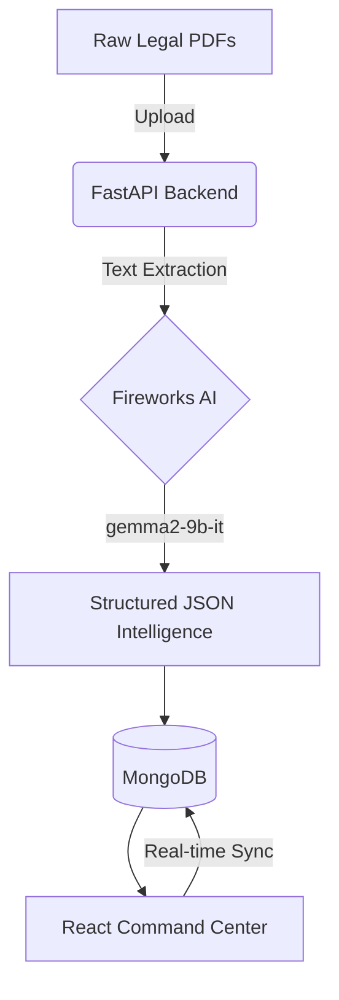

# LegalOS

> **Why LegalOS Wins**
> LegalOS transforms scattered legal documents into structured case intelligence.
> Instead of acting as a chatbot, LegalOS automatically creates cases, extracts legal context, identifies evidence gaps, builds timelines, explains risks, and helps legal managers make faster operational decisions.

*Built for AMD Developer Hackathon ACT II - Track 3 (Unicorn Track)*

---

## Problem Statement
Legal teams, insurance claims adjusters, and law firms spend countless hours manually reading through dense case files, FIRs, and legal notices to extract basic facts. Connecting timelines across dozens of documents and identifying missing evidence is a slow, error-prone, and heavily manual process.

## Our Solution
LegalOS is a zero-touch AI command center. Simply upload raw legal documents, and the system automatically extracts entities, builds a chronological timeline, cross-references claims for inconsistencies, detects risk levels, and generates actionable intelligence. It replaces manual discovery with instantaneous insight.

## Key Features
- **Zero-Touch Case Creation**: Upload a document and LegalOS automatically categorizes the case, generates a title, and builds the workspace.
- **Cross-Document Intelligence**: The system automatically detects mismatches (e.g., claim amount differences between FIR and Consumer Complaint) across multiple files.
- **Chronological Timeline Generation**: AI extracts dates and events to automatically build a visual timeline.
- **Evidence Gap Detection**: Identifies required documents and highlights what is missing based on the case type.
- **Risk Signal Detection**: Automatically flags high-risk cases that require immediate human intervention.

## Tech Stack
- **Frontend**: React, Vite, TanStack Router, TanStack Query, TailwindCSS
- **Backend**: FastAPI (Python), Motor (Async MongoDB)
- **Database**: MongoDB
- **AI Infrastructure**: Fireworks AI (Serverless API)

## Architecture



## AMD Technologies Used
LegalOS is heavily optimized for and relies upon AMD's world-class compute infrastructure:
- **Hardware**: Powered by **AMD Instinct™ MI300X** accelerators.
- **Environment**: Accelerated by the **ROCm** open software platform.
- **Execution**: The `gemma2-9b-it` model runs on Fireworks AI's AMD-powered serverless infrastructure, providing the massive context window and rapid inference speed required to process complex legal documents in seconds.

## Fireworks AI Usage
Fireworks AI is the core intelligence engine of LegalOS, used specifically for:
- **Document Classification**: Automatically identifying if an upload is an FIR, Policy, Notice, etc.
- **AI Case Brief**: Generating concise, legally-accurate summaries of the entire matter.
- **Timeline Extraction**: Pulling out disparate dates across documents and sequencing them.
- **Cross Document Intelligence**: Correlating facts between documents to detect contradictions.
- **Risk Signal Detection**: Evaluating textual severity to assign automated risk scores.

## MongoDB Usage
MongoDB serves as the primary document store, holding the unstructured text, structured AI responses, case metadata, user notes, and historical timeline events in a flexible schema perfectly suited for dynamic legal data.

## Setup Instructions

Getting LegalOS running locally is completely automated via Docker.

1. **Clone the repository**:
   ```bash
   git clone https://github.com/your-username/legalos.git
   cd legalos
   ```

2. **Configure Environment variables**:
   Create a `.env` file based on the provided template and add your Fireworks API key.
   ```bash
   cp .env.example .env
   ```

3. **Start the Platform**:
   ```bash
   docker-compose up --build
   ```

4. **Access the App**:
   - Frontend: `http://localhost:8080`
   - Backend API Docs: `http://localhost:8000/docs`

## Docker
The entire stack is containerized for seamless evaluation:
- `docker-compose up` spins up the Vite Frontend, FastAPI Backend, and a local MongoDB instance. No external database provisioning or manual dependency installation is required.

## Demo Flow
1. **Login** to the dashboard.
2. View the **Active Cases** metrics.
3. Open the **Smart Inbox** and upload a new raw PDF (e.g., an FIR or Insurance Claim).
4. Watch as the AI pipeline automatically extracts data, categorizes the document, and creates a new **Case Workspace**.
5. Navigate to the **Case Workspace** to view the AI Brief, automatically generated Timeline, Evidence Checklist, and Cross-Document Intelligence.

## Screenshots

### Dashboard
()
(
)

### Smart Inbox
(
)

### Case Workspace
(
)(
)

### Evidence Tracker
(
)

## Project Structure
```text
legalos/
├── frontend/               # React + Vite application (Root directory)
│   ├── src/                # UI Components and Routes
│   ├── public/             # Static Assets
│   ├── package.json
│   └── vite.config.ts
├── backend/                # FastAPI application
│   ├── app/                # API Routes and Prompts
│   ├── main.py             # Entrypoint
│   └── requirements.txt
├── assets/
│   └── screenshots/        # Demo images
├── docker-compose.yml      # Orchestration
├── Dockerfile              # Frontend container build
├── .env.example            # Environment template
└── README.md
```

## Future Roadmap
- **RAG for Precedents**: Connecting the case data to historical case law databases.
- **Multi-modal Inputs**: Support for uploading audio evidence and image analysis.
- **Automated Drafting**: Generating legal responses and template filings based on extracted case facts.

## Team
Built with ❤️ for the AMD Developer Hackathon.
